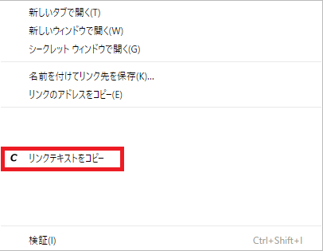
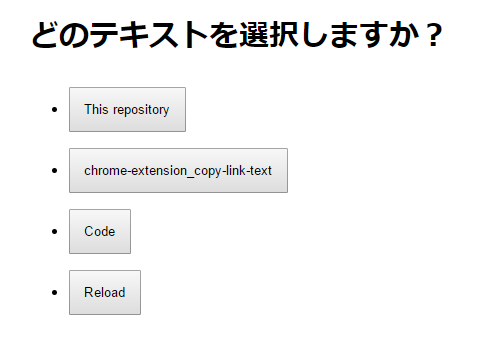

# これはなに？
リンクテキストをクリップボードにコピーするChrome拡張

# 備考
* リンクを右クリックした時のメニューに「リンクテキストをコピー」を追加  
	<kbd></kbd>
* 対象リンクを拡張が特定できなかった場合、候補を表示して選択する画面をポップアップすることがある  
	<kbd></kbd>
	* 右クリックしたリンクの `href` 属性でページ内リンクを検索するという方法をとっており、同一 `href` のリンクが複数存在すると右クリックしたリンクを自動的に特定できない
		* 権限を最小限に抑えるため
	* Escapeキー押下または右上の「閉じる」ボタンで選択画面を閉じることも可能
	* 同一 `href` のリンクのテキストが全て同じなら選択画面はスキップする
	* 同一ページで2回目以降の場合は不要
		* 1回目の際に右クリックの監視＆特定を開始するため
